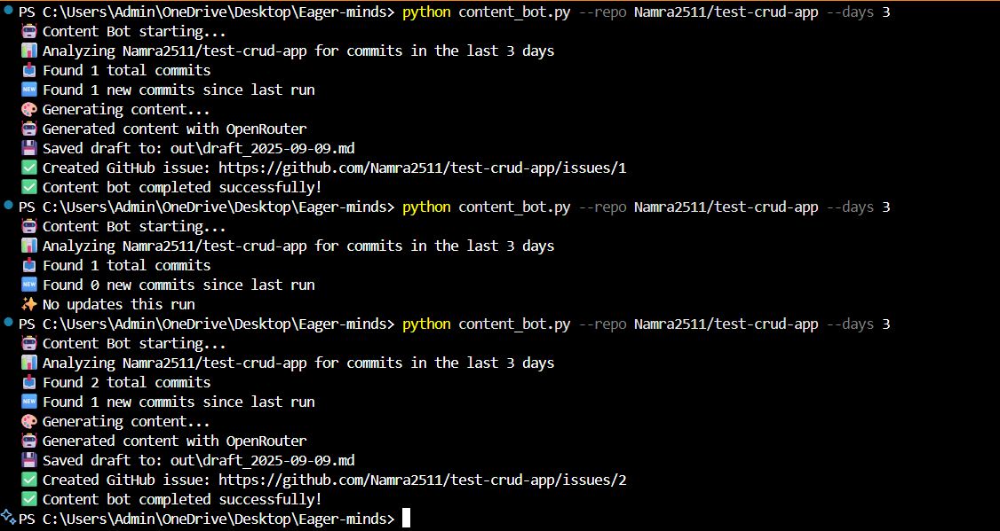
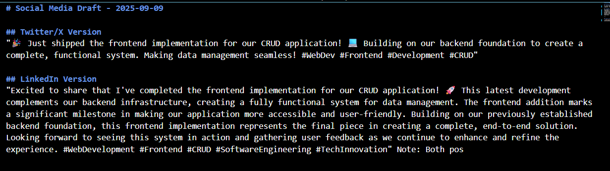
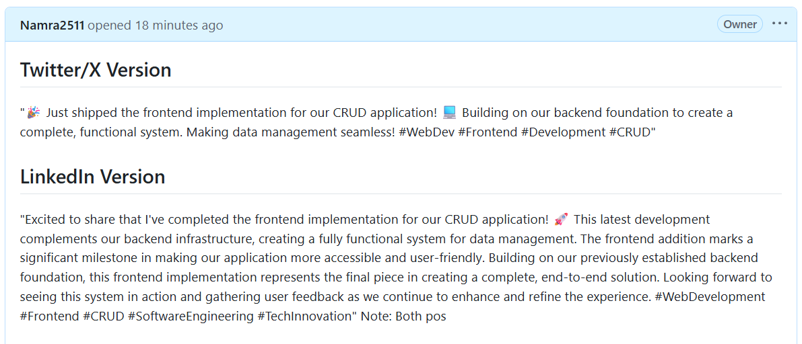

# Social Media Content Bot 🤖

## 🎥 Implementation Video
[Watch the Implementation Demo](https://drive.google.com/file/d/1Nbfyl-7srnJopAf5d1FrIqIbojRCslvH/view?usp=sharing) 


## 🚀 Setup

### Prerequisites
- Python 3.7+
- GitHub repository access
- OpenRouter API key (for AI-generated content)

### Installation Steps

1. **Clone the repository:**
   ```bash
   git clone https://github.com/Namra2511/Social-media-bot.git
   cd Social-media-bot
   ```

2. **Install dependencies:**
   ```bash
   pip install -r requirements.txt
   ```

3. **Set up environment variables:**
   Create a `.env` file in the root directory:
   ```bash
   TOKEN=your_github_token_here
   API=your_openrouter_api_key_here
   ```

4. **Get required tokens:**
   - **GitHub Token**: Go to [GitHub Settings > Tokens](https://github.com/settings/tokens) and create a personal access token with `repo` scope
   - **OpenRouter API Key**: Get from [OpenRouter Platform](https://openrouter.ai/keys) for AI-powered content generation


## 💻 Usage

```bash
# Basic usage - analyze last 3 days
python content_bot.py --repo yourusername/yourrepo

# Custom time range
python content_bot.py --repo yourusername/yourrepo --days 7

# Short form
python content_bot.py -r yourusername/yourrepo -d 5
```

## 📸 Screenshots

### Terminal Run

*Example of the bot running and processing commits*

### Generated Draft File

*Sample output showing Twitter/X and LinkedIn versions with source commits*

### GitHub Issue Created

*Automatically created GitHub issue with the social media content*


## 📁 Files Created

- `out/draft_YYYY-MM-DD.md` - Markdown file with the draft content
- `state.json` - Tracks last run time to avoid duplicates
- GitHub Issue with the same content


## 🔒 Safety Features

- **Secret Detection**: Automatically removes API keys, tokens, and passwords
- **Content Sanitization**: Replaces client/org names with generic terms
- **Fallback Mode**: Works without OpenAI API key using templates

## 🔧 Troubleshooting

### "TOKEN not found"
Make sure you've created a `.env` file with your GitHub token:
```
TOKEN=your_token_here
API=your_openrouter_key_here
```

### "No updates this run"
This means no new commits were found since the last run. The tool tracks processed commits in `state.json`.

### OpenAI API Issues
If OpenRouter fails, the tool automatically falls back to template-based generation.

## 📝 License

MIT License - feel free to modify and use as needed!
